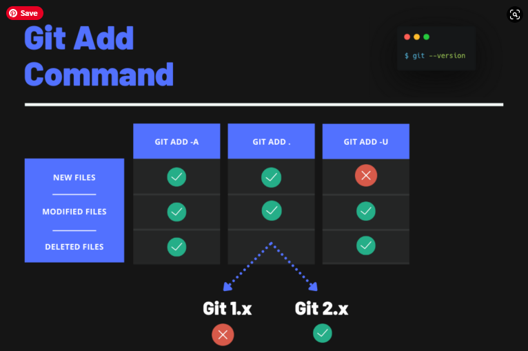

[< К содержанию](./readme.md)

## Что делает git add?

**Команда git add *[файл]*** добавляет файл в индекс

Чтобы добавить все файлы в каталоге индекс независимо от того, в какой директории вы находитесь (кроме игнорируемых), используйте команду:

```bash=
git add .
```
